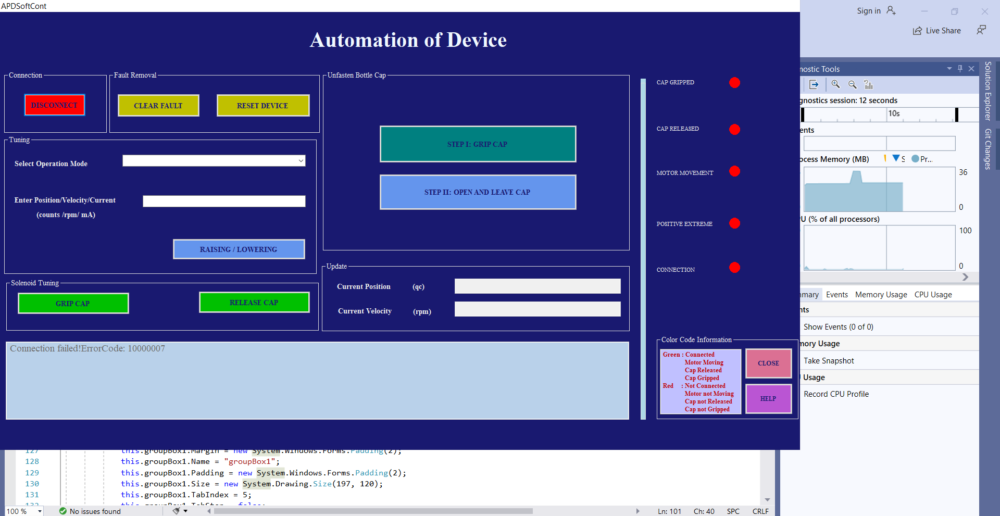

✅ Automation Requirements
Automated raising and lowering of the nut
Automated gripping and releasing of the bottle cap using solenoids

# Automation-Device
This device is designed to automatically open a bottle cap to enable controlled sample dispensing. The system uses a single-motor mechanism in combination with holding solenoids, concentric conducting bearings, leaf springs, and a limit switch to coordinate movement and automation.
Two concentric conducting bearings are mounted on the frame to provide electrical connections via leaf springs. These supply power to the solenoids as the system rotates.

⚙️ Operating Mechanism
The system uses two RS Pro holding solenoids, which are crucial to the cap-holding mechanism:
When a voltage pulse is applied, the solenoids activate and grip the bottle cap, maintaining their position without continuous power.The nut (which is connected to the solenoids) then begins to rotate and rise, unscrewing the cap from the bottle.A Microtex precision limit switch is mounted to detect the upper limit of the nut’s motion. Once triggered, it stops the rotation. Finally, an opposite polarity pulse is sent to the solenoids, causing them to release the cap. This sequence ensures consistent and automated opening of the bottle cap with minimal power usage and mechanical complexity.

💻 Software and Electronics
The control software is developed using C# in a Windows Forms application within Visual Studio. The hardware integration includes:
Maxon RE30 DC motor
Maxon EPOS controller for precise motor control
RS Pro holding solenoids
Microtex precision limit switch

